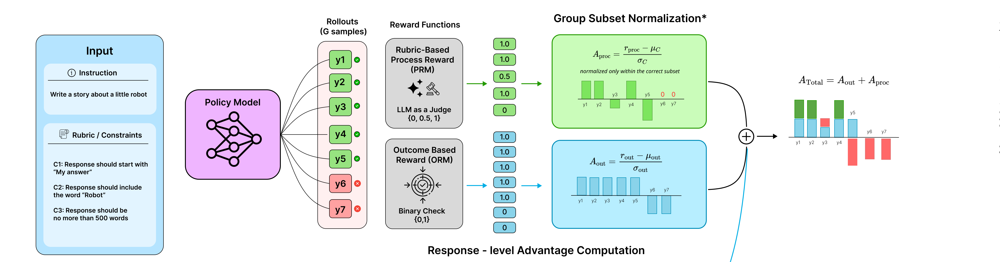

# RDAN-GRPO

**R**ubric **D**ecoupled **A**dvantage **N**ormalization GRPO: rubric-based RL for open-domain instruction following.

[Checkpoints on Hugging Face](https://huggingface.co/beingamanforever/Qwen3-4B-RDAN-GRPO) ·
[RDAN-GRPO collection](https://huggingface.co/collections/beingamanforever/rdan-grpo-6a845a4225a35fc112217ae6) ·
[Experimental details](docs/EXPERIMENTS.md)



## The idea

Instructions carry two kinds of requirement: objectively checkable ones ("start with 'My answer'",
"under 500 words") and matters of judgment (is it well written). Reward judged quality directly and
the policy learns that good prose earns credit while the hard constraints become optional.

RDAN samples `G` responses per prompt, scores each twice, and normalizes the two scores over
**different populations**:

```
A_out  = (r_out  - mu)   / sigma      over all G responses
A_proc = (r_proc - mu_C) / sigma_C    over constraint-satisfying responses only
A      = A_out + quality_weight * A_proc
```

The second denominator is the whole method. A response failing any hard constraint is excluded from
the process statistics entirely, so quality is a tiebreaker among compliant responses and never a
substitute for compliance. It also keeps learning alive once the outcome channel saturates and
carries no gradient.

The outcome channel is the deterministic hard rubrics (IFEval-style checkers, MulDimIF constraints,
sandboxed dataset rules, RubricHub rule routes). The process channel is the LLM-judged soft rubrics.

`rl_csr` and `rl_aon` are the reward-union baselines: one outcome channel over every rubric, mean
satisfaction or all-or-nothing respectively, with no process channel.

## Results

Qwen3-4B-Instruct-2507, full official datasets, greedy decoding, each benchmark scored by its own
evaluator. Instruction-level accuracy, strict.

| Checkpoint | IFEval | IFBench | MulDimIF | MATH-500 | GPQA |
|---|---|---|---|---|---|
| base | 82.99 | 30.95 | 57.17 | 87.60 | 55.05 |
| step 100 | 85.21 | 34.35 | 68.92 | 88.40 | **59.09** |
| **step 200** | **87.06** | **35.71** | 72.58 | 88.80 | 58.08 |
| step 300 | 86.69 | 34.69 | 73.25 | **89.60** | 57.58 |
| step 400 | 86.69 | 35.37 | 74.08 | 86.40 | 58.59 |
| step 420 | 86.88 | 33.67 | **74.67** | 87.20 | 55.56 |

IFEval and IFBench peak at step 200 and stay flat, moving by a handful of prompts out of 541 and 294.
MulDimIF climbs monotonically the whole way, +17.50 over base and still rising at 420; it is also the
benchmark closest to the training distribution.

MATH-500 and GPQA are out of domain, where flat is the intended result. Both rise early and decay
back to base by 420. The early GPQA gain was never better science: unparsable answers fell from
21/198 to 12/198 and truncations from 31 to 18, which accounts for it entirely. What erodes is that
format compliance over a long chain of thought. **Step 200 is the checkpoint to use** unless
MulDimIF is specifically the target.

Training stopped at step 430 of a planned 500 when the training host was released.

Scores, parse rates, and truncation counts per model are in [`results/`](results/); the per-prompt
generations are not committed and regenerate from the published checkpoints.

## Checkpoints

Weights are on the Hub, one folder per step, loadable with `from_pretrained`. The repo is private,
so these need access:

| Step | Subfolder |
|---|---|
| 100, 200, 300 | [`step-000100`, `step-000200`, `step-000300`](https://huggingface.co/beingamanforever/Qwen3-4B-RDAN-GRPO) |
| 320, 400, 420 | [`step-000320`, `step-000400`, `step-000420`](https://huggingface.co/beingamanforever/Qwen3-4B-RDAN-GRPO) |

```python
from transformers import AutoModelForCausalLM, AutoTokenizer

repo = "beingamanforever/Qwen3-4B-RDAN-GRPO"
model = AutoModelForCausalLM.from_pretrained(repo, subfolder="step-000200", dtype="bfloat16")
tokenizer = AutoTokenizer.from_pretrained(repo, subfolder="step-000200")
```

Trained with thinking disabled; evaluate the same way.

## Setup

Requires a checkout of RTT, which supplies the ROLL distributed RL runtime. On a fresh CUDA host the
setup script installs everything, including the pieces whose absence produces misleading errors
(Python headers for Triton, a flash-attn wheel matching the local torch build, and a wandb new enough
for current API keys):

```bash
scripts/setup_env.sh /path/to/Rubrics-To-Tokens /path/to/Qwen3-4B-Instruct-2507
```

Then fill in `OPENROUTER_API_KEY` and `WANDB_API_KEY` in the generated `.env`.

## Preflight

Run this before a long run. It generates on real prompts with the real model, scores them through the
real checkers and the real judge, and reports measured judge cost and latency projected over the full
horizon.

```bash
python scripts/preflight.py
```

## Training

```bash
python scripts/train.py --config rdan
```

Baselines from the same base model are `--config rl_csr` and `--config rl_aon`. Add `--resume` to
continue from the latest checkpoint.

### Changing the GPU count

`num_gpus` lives in [`configs/train/base.yaml`](configs/train/base.yaml), but Hydra overrides are
positional so scaling needs no config edit. The global batch is
`per_device_train_batch_size x gradient_accumulation_steps x world_size` and must divide
`rollout_batch_size x num_return_sequences_in_group`, so doubling the GPUs means halving the
accumulation:

```bash
python scripts/train.py --config rdan num_gpus=4 actor_train.training_args.gradient_accumulation_steps=16
```

## Evaluation

```bash
python scripts/eval_if.py --model base=/path/to/model --rtt-root /path/to/Rubrics-To-Tokens --out results/if-eval
```

```bash
python scripts/eval_ood.py --model base=/path/to/model --data-root /path/to/benchmark-data --out results/ood-eval
```

`eval_if.py` covers IFEval, IFBench, and MulDimIF, shelling out to each benchmark's own scorer so the
numbers are the benchmarks' own rather than a reimplementation. `eval_ood.py` covers MATH-500, GPQA
Diamond, and MMLU-Pro. Both cache generations, so a rerun costs nothing.

Token budgets are per benchmark and they matter: a truncated chain of thought still parses to some
trailing expression, so it scores wrong rather than being flagged. At 2048 tokens MATH-500 read 78.0
instead of 87.6, and GPQA read 36.4 against a 25 percent chance rate.

## Cost and wall clock

Measured on 2x A100 80GB, 64 prompts x 8 samples per step:

| Phase | Time per step |
|---|---|
| actor update | 195s |
| log-prob recompute | 54s |
| generation and reward | 66s |
| offload and weight sync | 14s |
| **total** | **~5.5 min** |

Roughly 1.9 days for 500 steps on 2 GPUs and about 1 day on 4. Judge spend is about $0.02 per step,
so around $10 for a full run against `qwen/qwen3.7-flash`.

Sequence length dominates, and both bounds come from measurement rather than convention: prompts are
mean 225 and p99.5 1280 tokens, and 97.2 percent of responses finish under 2048, so a row costs 3328
tokens instead of the 6144 the defaults implied. Watch `length/cap_hit_rate`; if it climbs well above
the measured 2 percent the response cap is truncating real work.

## Distilled baselines

The datasets carry prompts and rubrics but no reference answers, so the SFT and DPO baselines are
built by sampling a stronger model and keeping what the rubrics accept. Every sample is scored
through the same checkers and the same judge the RL reward uses, so all three methods optimize
against one definition of a good response.

```bash
python scripts/distill.py --samples 6 --budget 12
python scripts/build_preferences.py
```

Samples rank as `2 * hard_pass + quality`, which makes a satisfied constraint worth more than any
amount of prose, so the two datasets can never prefer a well-written violation. Fine-tuning runs in a
separate environment, because TRL needs transformers 5 while the ROLL runtime pins transformers 4.57:

```bash
uv pip install -r requirements-sft.txt
python scripts/finetune.py --stage sft --data data/distill/sft.jsonl --out output/sft
python scripts/finetune.py --stage dpo --data data/distill/dpo.jsonl --out output/dpo-sft --model output/sft/merged
```

Run DPO straight from base as well (`--out output/dpo-base`, no `--model`), otherwise a gain over
base cannot be attributed to the preference signal rather than to the SFT imitation underneath it.

## Outputs

Under `output/<exp_name>/`:

- `checkpoints/step-NNNNNN/actor/` - safetensors plus tokenizer, and the DCP shards needed to resume.
  The two most recent are kept for resume; every 100th step is kept permanently.
- `logs/metrics.jsonl` - every metric row, written before it reaches W&B, so curves survive a lost
  connection.
- `logs/curves/*.png` - reward, advantage, policy, length, and judge panels. Rebuild any time with
  `plot_curves` from `rdan_grpo.tracking`.

## Layout

| Path | Role |
|---|---|
| `src/rdan_grpo/advantages.py` | masked group standardization, shared by both channels |
| `src/rdan_grpo/scalar.py` | RDAN advantage composition and the baseline methods |
| `src/rdan_grpo/rewards.py` | rubric scoring and hard/soft channel extraction |
| `src/rdan_grpo/rules.py` | RubricHub checkers and the sandboxed dataset rule runner |
| `src/rdan_grpo/judge.py` | concurrent OpenRouter judge with retries and cost accounting |
| `src/rdan_grpo/reward_worker.py` | ROLL reward worker: local checkers, one judge fan-out per batch |
| `src/rdan_grpo/bridge.py` | ROLL batch protocol to RDAN advantage adapter |
| `src/rdan_grpo/pipeline.py` | training loop, checkpointing, metrics |
| `src/rdan_grpo/train_step.py` | one optimizer transaction over a rewarded batch |
| `src/rdan_grpo/workers.py` | FSDP2 actor and seeded vLLM rollout workers |
| `src/rdan_grpo/checkpoint.py` | atomic checkpoint promotion, resume lookup, retention, Hub upload |
| `scripts/` | environment setup, preflight, training, evaluation, distillation |

## Failure handling

Long RL runs on paid APIs fail in specific ways, so these are handled rather than crashed on:

- A judge call that exhausts its retries clears the soft channel for that response only. The response
  keeps its outcome reward and its place in the group, and `judge/failure_rate` records it.
- A deterministic checker that cannot decide clears that rubric's evaluation bit; the response drops
  out of the group statistics instead of being scored zero.
- A non-finite gradient skips the update and increments `skipped_updates` rather than ending the run.
- W&B being unreachable degrades to offline mode and then to the JSONL mirror.
- The trainer and the rollout engine share the same GPUs, so each releases its cached blocks at the
  handoff. Offloading tensors alone leaves the pages with PyTorch's allocator, and vLLM's KV pool
  cannot be mapped around them.

## Tests

```bash
pytest
```

Advantage expectations are recomputed in plain Python inside the tests, so they check the math rather
than echo it. Tests needing the ROLL runtime skip where it is unavailable and run on the training
host.

## License

Apache-2.0, see [`LICENSES/`](LICENSES/).
